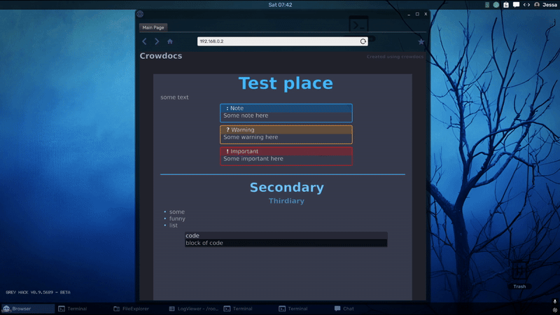
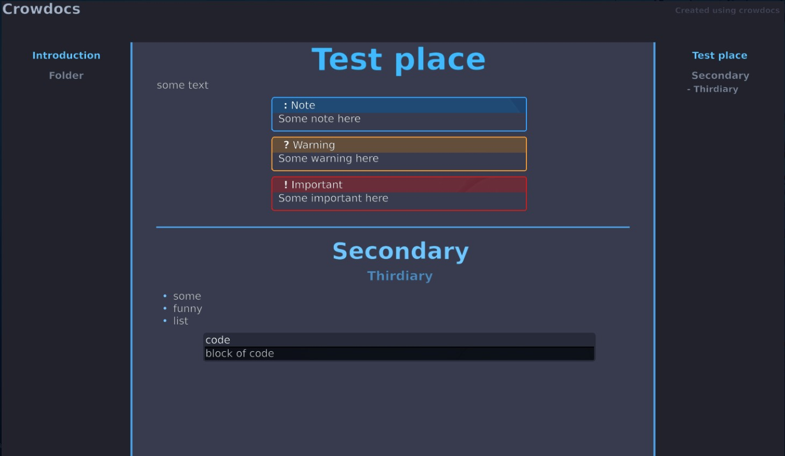
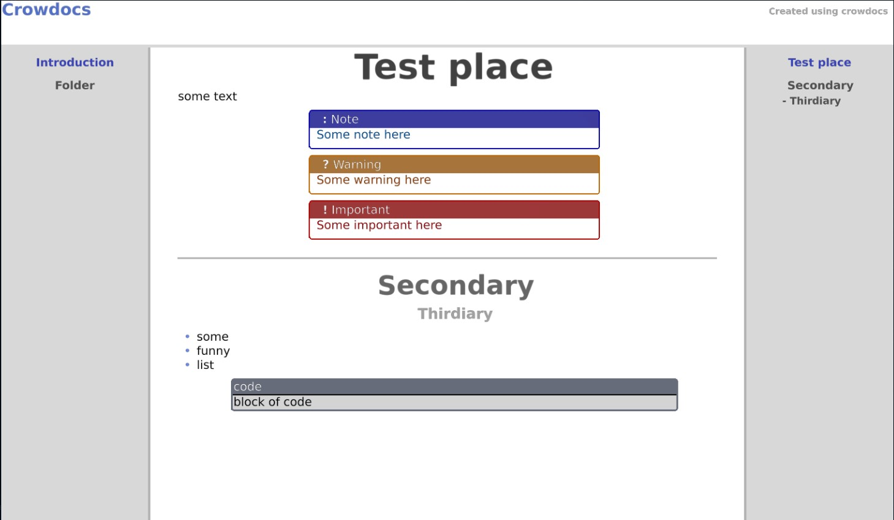
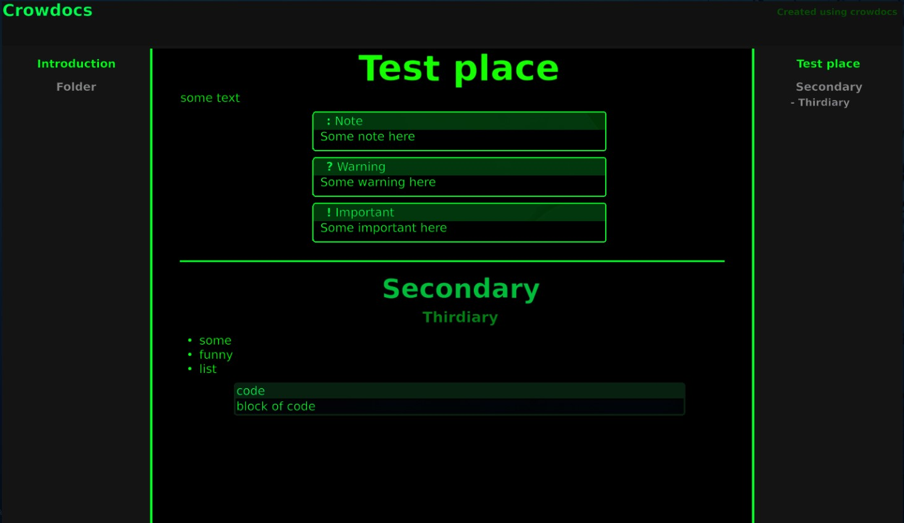
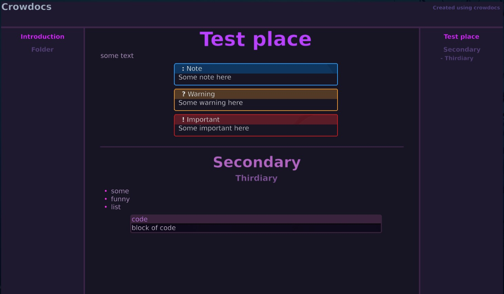

# Crowdocs

**A markdown to static html website converter aimed specifically to work for the game [greyhack](https://store.steampowered.com/app/605230/Grey_Hack/)**

It houses features such as:

- Color themes (Including custom ones)
- Page navigation
- Admonitations
- Code blocks
- Reactive UI
- Lists
- Functioning scroll wheel


**Table of contents**

<!-- @import "[TOC]" {cmd="toc" depthFrom=2 depthTo=6 orderedList=false} -->

<!-- code_chunk_output -->

- [Limitations](#limitations)
- [Requirements](#requirements)
- [Preview](#preview)
  - [Default themes](#default-themes)
- [Usage](#usage)
  - [Settings.cfg](#settingscfg)
    - [Theme](#theme)
    - [Title](#title)
    - [folder](#folder)
  - [Structure](#structure)
  - [Nav.cfg](#navcfg)
    - [Order](#order)
    - [Names](#names)
  - [Markdown](#markdown)
    - [Headers](#headers)
    - [Lists](#lists)
    - [Widgets](#widgets)
    - [Code](#code)
    - [Dropdowns](#dropdowns)
    - [Extra](#extra)
- [Planned for future](#planned-for-future)

<!-- /code_chunk_output -->


## Limitations


The final file may **NOT** exceed 160k characters to be used within greyhack.
Generator.py will give a big red warning in case this was exceeded.
This is a limitation of the game, not this generator.

**Currently this generator has no support for:**

Markdown operators such as `*`, `_`, <code>\`</code> or `[link masking](#header)`
*(the effects of `*` and `_` can still be achieved using `<b>`, `<i>` or `<u>`)*
*(This will be added in later updates)*

Deep folder structures.
It has up to max 1 folder depth of markdown parsing. 
Anything above that will not work.
*(This is intentional, and will not be fixed)*


## Requirements

To use the `generator.py` file, you need `python >= 3.6`.


## Preview



### Default themes


<details>
<summary><b>Dark</b></summary>


</details>


<details>
<summary><b>Light</b></summary>


</details>


<details>
<summary><b>Haxor</b></summary>


</details>

<details>
<summary><b>Purple</b></summary>


</details>

___


## Usage
  
### Settings.cfg

settings.cfg has 3 options:
- Theme
- title
- folder

#### Theme

Can be any of:
- dark
- light
- haxor
- purple
(see [themes](#default-themes) for examples)

or you can copy / edit one of them to use yourself

#### Title

Title to be displayed at the top left of the page.

#### folder

Which folder to parse for markdown to html conversion.

___

### Structure

Each folder expects an index.md, which it'll use as it's primary
however, if none can be found, it'll just use the very first available one instead.

If a markdown file is not within a folder, it'll be used as a standalone page in the left navigation bar.
A folder can have a `nav.cfg` file to set the expected order / set titles

an example folder structure:

```
|-[ docs_folder
| |- index.md
| |- nav.cfg
| |
| |-[ fruits
|   |- index.md
|   |- banana.md
|   |- apple.md
|  _|- nav.cfg
| |
| |-[ birds
|   |- index.md
|   |- crow.md
|___|- raven.md
```

___

### Nav.cfg

`nav.cfg` determines the order and titles of files in the current directory

```ini
[general]
order = file.md folder

[names]
file.md = Introduction
folder = Something
```

#### Order

Order is left to right, seperated by spaces.
Not all files need to be clarified, all other files will be ordered in whatever way they'll be added in.

#### Names

This is used to change the parsed-name of a file/folder to appear different in the final html document

___

### Markdown

#### Headers

Headers are the same as in normal markdown files.
Just use `#` for headers
`# Title`
`## Header`
`### Header level 2`
`#### Header level 3`

!!!
    Header level 3 (`####`) will not be added to the table of contents to the right of the screen

#### Lists

This html converter does not allow for numbered or embdedded lists, due to greyhack being kind of silly with it.

Other than that, lists work with `-`

```
- list
- item
- example
```

#### Widgets

This converter has 3 different widgets:
- Notes
- Warning
- Important
  
each are invoked similarly, but with different symbols.

**Note**
```
=== Title
    Message
```

**Warning**
```
??? Title
    Message
```

**Important**
```
!!! Title
    Message
```

Title is not required, and will default to the widget type if none are provided.

#### Code

Since I can't have proper code syntax highlighting in greyhack, where you would usually put the language is now being used as the title for the code block.

**Example**
~~~
```title
content
```
~~~

#### Dropdowns

```
vvv title [state]
[content]
^^^
```

`vvv title [state]` is the opening
`title` HAS to be set, `state` does not.

`state` can be either `open` or `closed`

everything in the content will be parsed like normal. Meaning that you can technically have nested dropdowns.

Examples:
```
vvv Example open
this dropdown is open by default
^^^

vvv Example2 closed
This drop down is closed by default
^^^

vvv Example3
This drop down is also closed by default
^^^
```

#### Extra

If there is any piece of html that this doesn't use, you can use raw html tags within and it'll get parsed as html. Beware, this has a high chance to lead to bugs.

for example

This example has a working dropdown that shows the important widget when opened.

___

## Planned for future

- Markdown operators
- Linking to other headers/pages
- Previous/Next buttons at the bottom of the page